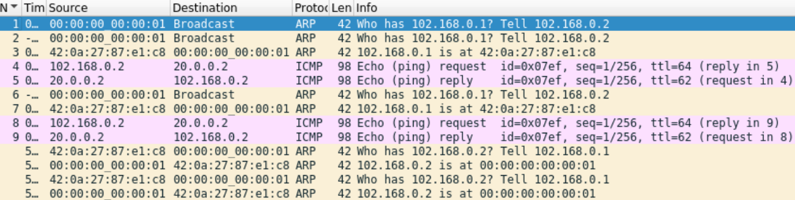

<!DOCTYPE html>
<html lang="en">
<head>
  <meta charset="UTF-8">
  <meta name="viewport" content="width=device-width, initial-scale=1.0">
</head>
<body>

<!-- Automatycznie generowany tytuł dokumentu -->
<h1 style="text-align: center;">Projektowanie i implementacja systemów sieciowych w środowisku wirtualnym</h1>

<!-- Opis -->
<section>
  <h2>Opis</h2>
  

    Projekt dotyczy zaprojektowania i implementacji systemu sieciowego w środowisku wirtualnym. Elementy systemu takie jak router i switch powinny realizować swoje podstawowe funkcje.Ponadto router powinien wykrywać awarię i skutecznie ją omijać.
  

</section>

<!-- Narzędzia -->
<section>
  <h2>Narzędzia</h2>
  <ul>
    <li><strong>P4APP</strong> - Uruchamianie, budowanie, debugowanie i testowanie programów w języku P4</li>
    <li><strong>Mininet</strong> - Oprogramowanie do wirtualizacji sieci</li>
    <li><strong>p4c</strong> - Kompilator programów P4</li>
    <li><strong>P4Pi</strong> - Platforma open-source umożliwiająca uruchomienie programów P4 na Raspberry Pi</li>
  </ul>
</section>

<!-- Technologie -->
<section>
  <h2>Technologie</h2>
  <ul>
    <li><strong>Python</strong> - Język programowania</li>
    <li><strong>P4</strong> - Język programowania płaszczyzny danych w sieci</li>
    <li><strong>BMV2</strong> - Switch operujący na poziomie oprogramowania, na którym uruchamiamy program P4 skompilowany przy pomocy p4c</li>
    <li><strong>Socket</strong> - Biblioteka do tworzenia socketów, które wysyłają lub wykrywają nadchodzący pakiet</li>
    <li><strong>Scapy</strong> – Biblioteka Pythona do tworzenia i dekodowania pakietów oraz ich wysyłania i odbierania</li>
    <li><strong>P4Runtime</strong> - Interfejs lokalnej warstwy sterowania sieciowego, który zarządza płaszczyzną danych w P4, oraz monitorowanie reguł przekazywania pakietów i stanu urządzenia</li>
  </ul>
</section>
<!-- PW-OSPF -->
<section>
  <h2>PW-OSPF - skrócony opis</h2>
  
    PW-OSPF to stosunkowo prosty protokół routingu oparty na OSPFv2, który obsługuje sieci z pseudowire( emulowanego połączenia punkt-punkt w MPLS). Routery regularnie wysyłają pakiety HELLO, aby odkrywać sąsiadów i utrzymywać łączność. Po wykryciu zmiany w sieci, każdy router rozgłasza swoje informacje o sieci, a algorytm Dijkstry jest używany do obliczenia tras. PW-OSPF umożliwia dynamiczne zarządzanie trasami w sieciach z pseudowire.
  
    
  
    W protokole PW-OSPF obsługujemy 2 typy protokołów:
  
    
  
  <b>PWOSPF Hello Protocol</b> służy do odkrywania i utrzymywania stanu dostępnych połączeń, gdzie routery periodycznie nasłuchują i rozsyłają pakiety HELLO, określając, że brak odpowiedzi od sąsiada oznacza, że router jest niedostępny. Odbiór pakietu HELLO informuje o czasie działania sąsiada oraz umożliwia śledzenie połączeń między routerami.
  
    
  
  <b>PWOSPF Link State Updates</b> służy do rozsyłania informacji o lokalnej łączności oraz sąsiednich routerach w sieci. Te aktualizacje wysyłane są okresowo, w celu aktualizacji bazy danych topologii sieciowej w każdym routerze.
  Dodatkowo, protokół umożliwia routerowi bramy reklamowanie domyślnej podsieci dla interfejsu połączonego z oddzielną siecią
  
  
</section>

<!-- Topologia -->
<section>
  <h2>Topologia</h2>
  

  
  

  
Zaproponowana przez nas topologia sieci składa się z 3 hostów, 3 routerów i 1 switcha. Dzięki takiej konstrukcji sieci możemy pokazać zaimplementowane mechanizmy. Połączenie routerów w trójkącie daje nam możliwość pokazania jak poprzez protokół PW-OSPF zmieniamy statyczny routing, omijamy awaryjne łącza. Natomiast para hostów podłączona do sieci poprzez switch umożliwia przetestowanie mechanizmów zaimplementowanych dla switcha. Dodatkowo do każdego switcha i routera przydzielamy osobny agent routingu.

</section>

<!-- Mininet i Linux -->
<section>
  <h2>Mininet i Linux</h2>
  
  <!-- Implementacja topologii w Pythonie -->
  <subsection>
    <h3>Implementacja topologii w Pythonie</h3>
    <a href="/Mininet/my_topo.py">Kod w pythonie
  </subsection>
  
  <!-- Przykładowy przepływ pakietów -->
  <subsection>
    <h3>Przykładowy przepływ pakietów</h3>
     

    
     

    
Na początku wszystkie pakiety idące do h1 przechodzą przez r1 i r2. Natomiast, gdy zasymulujemy awarię to zgodnie z tabelą routingu idą domyślną trasą, czyli przez łącze pomiędzy r1 i r3.

    

    
    

    
Na powyższym zrzucie ekranu z programu wireshark widzimy przykładowy przepływ pakietów w przypadku komunikowania się dwóch hostów w tej samej podsieci. Przy nawiązywaniu połączenia na początku host h2 wysyła żądanie ARP na adres rozgłoszeniowy, a switch przekazuje je wszystkim podłączonym do niego urządzeniom. Następnie przekazuje on otrzymaną otpowiedź z powrotem do nadawcy żądania ARP. Taka sama sytuacja ma miejsce, gdy host h3 chce odpowiedzieć na ping, a na końcu następuje wymiana wpisami w tablicy ARP.  

        

    
    

    

    
    

  </subsection>
</section>

<!-- Implementacja -->
<section>
  <h2>Projekt implementacji systemu z wykorzystaniem P4Pi</h2>
  
  <!-- RAW Socket -->
  <subsection>
    <h3>RAW Socket</h3>
    <ul>
      <li><strong>Implementacja interfejsów routera i switcha</strong></li>
      <li><strong>Sniffing pakietów</strong></li>
      <li><strong>Wstrzykiwanie pakietów</strong></li>
    </ul>
  </subsection>
  
  <!-- Router -->
  <subsection>
  <h3>Router</h3>
   <ul>
      <li>Data plane</li>
      <ul>
      <li><strong>Procesor pakietów odpowiedzialny za przetwarzanie pakietów przychodzących do routera</strong></li>
      <li><strong>Tabela routingu, która dokonuje dopasowania najdłuższego prefiksu na adresie docelowym, aby połączyć adres IP następnego urządzenia z portem wyjściowym</strong></li>
      <li><strong>Tabela ARP, która ustala docelowy adres MAC na podstawie IP następnego skoku</strong></li>
      <li><strong>Sprawdzanie wartości i dekrementacja TTL</strong></li>
      <li><strong>Aktualizacja źródłowego adresu MAC na podstawie ustawionego portu wyjściowego </strong></li>
      <li><strong>Wysłanie pakietu poprzez wcześniej ustalony port wyjściowy</strong></li>
      <li><strong>Przesyłanie pakietów przeznaczonych dla lokalnego routera do lokalnej warstwy sterowania</strong></li>
      <li><strong>Odrzucanie pakietów innych protokołów niż te sprecyzowane przy parsowaniu do lokalnej warstwy sterowania</strong></li>
      <li>Odrzucanie niepoprawnych pakietów IP</li>
      </ul>
    <!-- Control plane -->
      <li>Control plane</li>
      <ul>
      <li><strong>Aktualizacja tabeli ARP</strong></li>
      <li><strong>Wysyłanie zapytań ARP</strong></li>
      <li><strong>Generowanie pakietów ICMP o niedostępności hosta</strong></li>
      <li><strong>Odpowiadanie na żądania echo ICMP</strong></li>
      <li><strong>Tworzenie tabeli forwardingu poprzez protokół dynamicznego routingu PW-OSPF</strong></li>
      <li><strong>Wsparcie statycznej tablicy routingu w dodatku do ścieżek protokołu PW-OSPF</strong></li>
      <li><strong>Obsługa pakietów kierowanych bezpośrednio do routera</strong></li>
      <li>Wysyłanie i odbieranie pakietów protokołu PW-OSPF</li>
      </ul>
   </ul>
  </subsection>
  
  <!-- Switch -->
  <subsection>
  <h3>Switch</h3>
   <ul>
      <li>Data plane</li>
      <ul>
      <li><strong>Procesor pakietów odpowiedzialny za przetwarzanie pakietów przychodzących do switcha</strong></li>
      <li><strong>Tabela adresów MAC dokonująca dokładnego dopasowania adresu MAC docelowego urządzenia i wysyłająca pakiet do odpowiedniego portu wyjściowego lub odpowiedniej grupy multicastowej</strong></li>
      <li>Wysłanie powiadomienia warstwy sterowania o nowym powiązaniu źródłowego adresu MAC z portem</li>
      </ul>
    <!-- Control plane -->
      <li>Control plane</li>
      <ul>
      <li><strong>Aktualizacja tabeli zawierającej pary adres MAC i port wyjściowy</strong></li>
      <li>Konfiguracja grupy multicastowej</li>
      </ul>
   </ul>
  </subsection>
</section>

</body>
</html>
